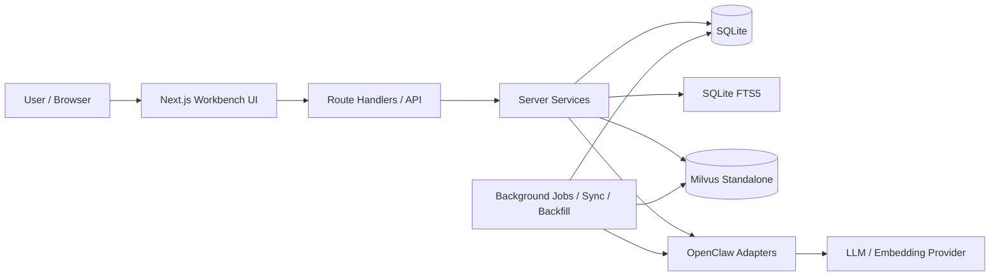

# Open Interview Technical Design

- doc_type: technical_design
- audience: agents / implementers / maintainers
- status: active
- updated_at: 2026-04-02
- canonical_for: 系统级技术架构总览、技术路线、全局模块边界、最新框架图、roadmap、技术子文档索引

## 0. How to use this doc

这个文件是 **Open Interview 的技术总设计入口**。

它负责：
- 解释系统当前的整体技术架构
- 维护唯一最新版的全局技术框架图
- 说明核心模块边界与关键设计决策
- 给出当前 roadmap 与推荐执行顺序
- 关联各技术子文档

它**不负责**承载所有细节。

详细规范继续分别维护在：
- `docs/tech-stack.md`
- `docs/data-model.md`
- `docs/api-schema.md`
- `docs/ui-flows.md`
- `docs/qa-dialog-rag-plan.md`

## 1. 系统目标与非目标

### 1.1 系统目标
Open Interview 的目标是把“面试准备”收口成一个可持续积累的工作台系统：

1. 导入原始资料（面经 / 知识笔记 / 简历）
2. 解析出结构化候选结果
3. 经过人工审阅后写入 canonical 数据
4. 形成 Question Bank / Interview Notes / Resume 等长期资产
5. 在 grounded retrieval 的前提下提供 QA / 复习辅助

### 1.2 非目标
当前不把项目做成：
- 通用聊天 App
- 多人协作平台
- 微服务拆分系统
- 重型分布式搜索平台
- 产品内 agent orchestration runtime

## 2. 最新技术框架图



## 3. 全局模块边界

### 3.1 UI / App
- Next.js App Router + React
- 产品形态是 **workbench-first**
- 主要路由包括 import / review / questions / interviews / qa / resume

详细见：`docs/ui-flows.md`

### 3.2 API / Route Handlers
- 只承担薄边界职责
- 做输入校验、调用 service、返回稳定 envelope
- 不承载复杂业务逻辑

详细见：`docs/api-schema.md`

### 3.3 Services / Repositories
- 负责主业务编排
- 串联导入、解析、确认、检索、QA 等流程
- 是 route handlers 与底层存储 / adapters 的主桥梁

### 3.4 Business Source of Truth
- SQLite 是业务真相源
- 结构化实体（question / answer / source / session / resume 等）留在 SQLite
- 检索层不能反客为主

详细见：`docs/data-model.md`

### 3.5 Retrieval Layer
当前 canonical 路线：
- SQLite FTS5：词法召回 / faceted filtering
- Milvus：向量语义召回
- 应用层：hybrid retrieval、structured expansion、merge/rerank

详细见：
- `docs/tech-stack.md`
- `docs/qa-dialog-rag-plan.md`

### 3.6 AI Adapter Boundary
- 所有 provider I/O 通过 OpenClaw server-only adapters
- 解析、grounded answer、embedding generation 都走 adapter 层
- 不允许 provider 逻辑扩散到 UI 或 routes

## 4. 核心主链

### 4.1 Import / Parse / Confirm 主链
```text
raw input
  -> source_document
  -> parse_job
  -> parse result review
  -> human confirm
  -> canonical write
```

### 4.2 QA / RAG 主链
```text
user query
  -> normalize query
  -> detect metadata filters
  -> optional standalone rewrite
  -> SQLite FTS recall
  -> Milvus vector recall
  -> structured expansion
  -> merge / lightweight rerank
  -> grounded prompt assembly
  -> answer with citations
  -> persist retrieval log / answer_mode / session turn
```

QA / RAG 的完整细节与 slice 拆分见：`docs/qa-dialog-rag-plan.md`

## 5. 当前关键架构决策

1. **产品是 workbench-first，不是 chat-first**
2. **SQLite 是业务真相源**
3. **Milvus 是当前 canonical 向量检索后端**
4. **SQLite FTS + Milvus = hybrid retrieval 主链**
5. **Route handlers 保持薄，复杂逻辑进 services**
6. **AI provider 逻辑只存在于 server-only adapter boundary**
7. **任务演进与执行留痕进入 `tasks/`，不把过程性信息塞进 canonical 设计文档**

## 6. 技术子文档索引

### 6.1 基础子文档
- `docs/tech-stack.md`
  - 技术栈、运行时、repo layout、部署边界、实现默认约束
- `docs/data-model.md`
  - 实体、关系、字段契约、状态流转
- `docs/api-schema.md`
  - API 契约与返回格式
- `docs/ui-flows.md`
  - 路由、页面定义、状态与交互流

### 6.2 专项子文档
- `docs/qa-dialog-rag-plan.md`
  - QA / RAG 设计、检索主链、grounded answer、专项 roadmap

## 7. Tasks / Plans / Retrospectives / Templates 目录规范

技术文档之外，所有执行过程与留痕统一进 `tasks/`：

- `tasks/slices/`
  - 有边界的实现切片
- `tasks/plans/`
  - 阶段性计划、执行计划、专项计划
- `tasks/retrospectives/`
  - 复盘材料
- `tasks/templates/`
  - 执行模板（例如 Codex prompt 模板）

规则：
- **是否要长期对外表达系统设计？** 放 `docs/`
- **是否是一次迭代、执行、复盘、提示模板的留痕？** 放 `tasks/`

## 8. 当前 roadmap

### 已落地主链
- import / parse / review / canonicalization 主链已经形成稳定 workbench 闭环
- `/questions`、`/interviews`、`/resume`、`/practice`、`/qa` 五条核心工作台路由都已在仓库中落地
- QA 2.0 baseline 已落地：SQLite FTS + Milvus hybrid retrieval、history-aware rewrite、grounded answer chain、对话式 session shell
- interview question 与 question bank 已正式解耦：面经确认默认写入 `interview_question`，后续再按需 promote / merge 到题库
- practice 已具备 random drill、10 题 mock exam 与长期 practice profile

### 当前优先主线
1. 围绕已落地主链做 product polish、稳定性与文档收口，而不是继续把 9A / 9B / 9C / 9D 视作 future work
2. 持续观察 retrieval quality、support-level 语义与 fallback 体验，补齐 eval / 调参闭环
3. 继续打磨 interview -> question bank 沉淀、practice 画像、resume deep-dive 之间的协同体验
4. 补齐健康检查、验证脚本、任务状态与 canonical docs 的同步维护

### 后续可演进方向
- 更细粒度 retrieval eval 与 rerank
- 更成熟的 practice analytics / personalized study loop
- 更成熟的 resume / project deep-dive 闭环
- 需要时再评估 LangGraph 或更复杂检索编排

## 9. 文档维护规则

### 更新 `README.md`
当你在更新：
- 项目定位
- 项目目标
- 项目整体状态
- 文档导航

### 更新 `docs/technical-design.md`
当你在更新：
- 全局技术架构
- 模块边界
- 最新框架图
- 当前 canonical 技术路线
- roadmap

### 更新技术子文档
当你在更新：
- 专项领域的详细设计或契约
- data model / api / ui / qa-rag 的具体规则

### 更新 `tasks/`
当你在记录：
- plan / task / slice / retrospective / prompt template
- 某轮实现、某次需求迭代、某次验收的过程性材料

一句话：

> `README` 管项目入口，`technical-design` 管技术总览，子文档管专项细节，`tasks/` 管全过程留痕。
